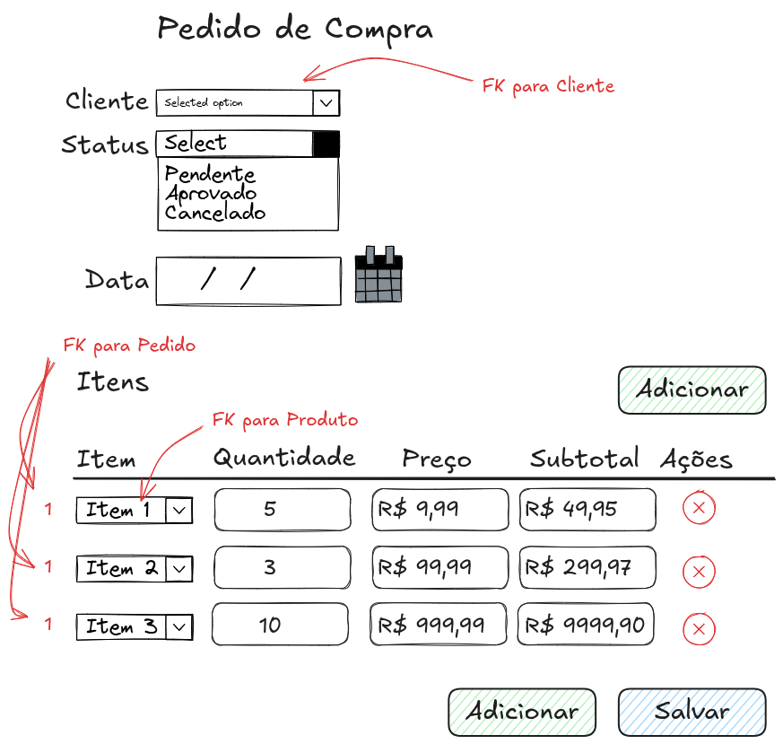

# django-modelagem

Exemplo de modelagem genérica para vários projetos em Django.

A imagem a seguir é apenas um exemplo de uma modelagem de dados que pode servir para vários casos.


No primeiro exemplo podemos usar a modelagem para criar um sistema de Pedidos de Compra,



mas se você olhar na pasta img vai ver que podemos usar o mesmo modelo para criar um sistema de:

* Orçamentos
* Vendas
* Ordem de Serviço
* Estoque
* Carrinho de Compras

E uma infinidade de outros exemplos.

Ou seja, é tudo igual.

## Este projeto foi feito com:

* [Python 3.14.2](https://www.python.org/) Mas você pode usar do Python 3.12+
* [Django 6.0](https://www.djangoproject.com/)

## Como rodar o projeto?

* Clone esse repositório.
* Crie um virtualenv com Python 3.
* Ative o virtualenv.
* Instale as dependências.
* Rode as migrações.

```
git clone https://github.com/rg3915/django-modelagem.git
cd django-modelagem

python -m venv .venv
source .venv/bin/activate

pip install -r requirements.txt

python contrib/env_gen.py

python manage.py migrate
python manage.py createsuperuser

# Iniciar PostgreSQL via Docker
docker-compose up -d

# Rodar o servidor
python manage.py runserver
```
